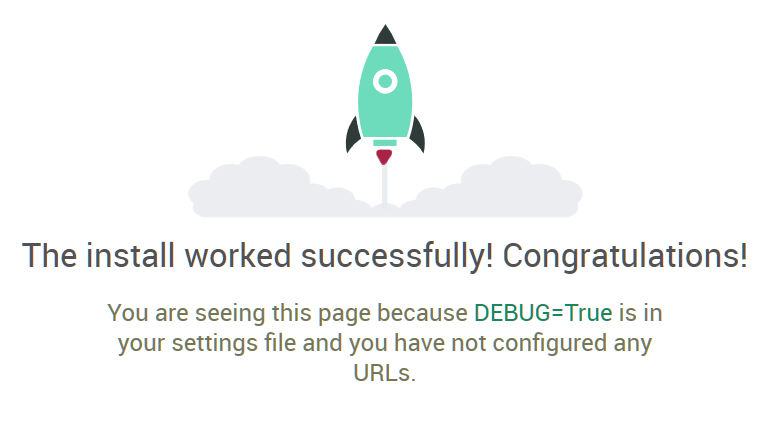

# Running the One-Step Development Environment Creator

## Create a new repository
1. Log into GitHub
2. Press the `+` button at the upper left and select "Import repository".
3. Import from this repository with a new name.

## Configuring the run
1. Open a terminal.
2. Clone the repository you created above and `cd` into it.
3. Copy your database backup into `Backups`. If the backup contains database ownership, you'll need to set `DEVELOPMENT_DATABASE_OWNER` in `.env` to the database owner.
    * If you want to run the sample `dead_songs` project, copy `dead_songs.sql` into `Backups`.
4. Copy `env.sample` to `.env` and edit `.env`:
    * If you want tp run the sample `dead_songs` project, you don't need to change anything.
    * Change PROJECT_NAME
    * Change DEVELOPMENT_POSTGRES_NAME
    * Change DEVELOPMENT_DATABASE_OWNER
    * Change the passwords and secret keys

## Running the creation script
1. Type `bin/onestep-create.sh`. This will
    * remove the sample project files,
    * build the database and API Docker images,
    * bring up the Docker network.

    When the network is up, you'll see something like

    ```
    api_development_1  | April 29, 2018 - 08:52:18
    api_development_1  | Django version 2.0.1, using settings 'dead_songs.settings'
    api_development_1  | Starting development server at http://0.0.0.0:8000/
    api_development_1  | Quit the server with CONTROL-C.
    ```
2. Browsing to the running containers: On Linux, Docker for Mac or Docker for Windows, the IP address is `localhost`. On Docker Toolbox, which uses Docker Machine, do `docker-machine ls` to determing `<machine-name>` and then `docker-machine <machine-name> ip`.

    You can browse to `http://<ip-address>:8000` to verify the server is live. You should see a Django default page.



    You can access the database from the host using `pgAdmin` or `psql`. The username is `postgres`, password is the one you set for `postgres` in `.env`, host is `<ip-address>` and the port is the one you set in `.env`, usually 5439.
3. After verifying that the server is there, press `CTRL-C`. This will shut down the database and API services.
4. The script will copy the generated code for your project to the repository.
5. Check your remote - `git remote -v`. Make sure you'll be pushing to the new repository, not the template!
6. `git add .; git commit; git push`.
